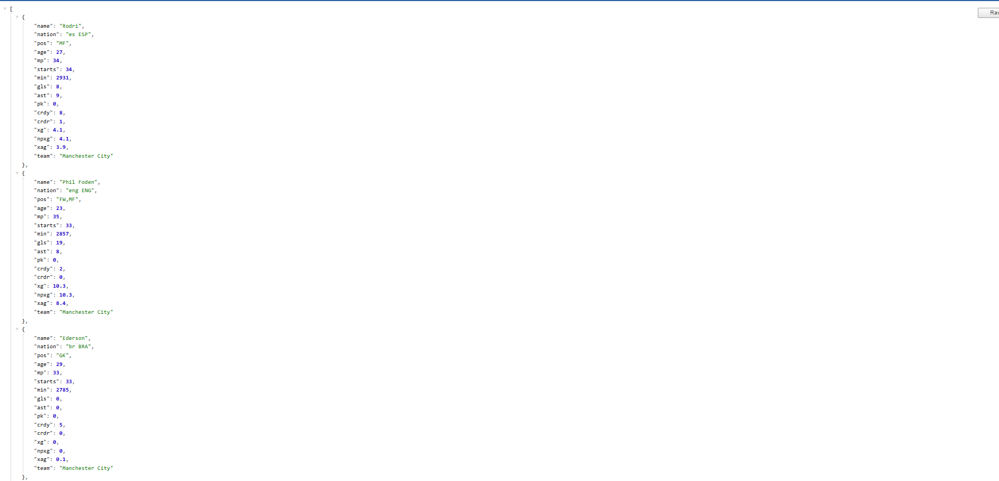

# PremZone
# Premier League Player API



## Overview

This is a RESTful API for managing Premier League player data, built with Spring Boot and PostgreSQL. The project stems from my passion for soccer and Fantasy Premier League, allowing users to interact with player data through various endpoints following REST API design principles.

## Technologies Used

- **Backend**: Spring Boot
- **Database**: PostgreSQL
- **Frontend**: Next.js (auxiliary component, not the main focus)

## Project Structure

The project follows a standard Spring Boot architecture with the following components:

- **Controller**: Handles HTTP requests and responses
- **Service**: Contains business logic
- **Repository**: Interfaces with the database
- **Model**: Defines the data structure

## API Endpoints

### Get Players

```
GET /api/v1/player
```

This endpoint retrieves players based on optional filter parameters:

| Parameter | Description |
|-----------|-------------|
| team      | Filter players by team name |
| name      | Search players by name |
| pos       | Filter players by position |
| nation    | Filter players by nationality |

Examples:
- `/api/v1/player?team=Arsenal` - Returns all Arsenal players
- `/api/v1/player?pos=Midfielder` - Returns all midfielders
- `/api/v1/player?team=Chelsea&pos=Forward` - Returns all Chelsea forwards

### Add Player

```
POST /api/v1/player
```

Adds a new player to the database. The request body should contain the player details in JSON format.

### Update Player

```
PUT /api/v1/player
```

Updates an existing player's information. The request body should contain the updated player details in JSON format.

### Delete Player

```
DELETE /api/v1/player/{playerName}
```

Deletes a player by their name.

## Setup and Installation

1. **Prerequisites**:
   - Java 11 or higher
   - Maven
   - PostgreSQL
   - Node.js and npm (for the Next.js frontend)

2. **Database Configuration**:
   - Create a PostgreSQL database
   - Update the database connection properties in `application.properties`

3. **Running the Application**:
   ```bash
   # Clone the repository
   git clone https://github.com/yourusername/premier-league-player-api.git
   
   # Navigate to the project directory
   cd premier-league-player-api
   
   # Build and run the Spring Boot application
   mvn spring-boot:run
   ```

4. **Testing the API**:
   - Use tools like Postman or curl to test the API endpoints
   - Example: `curl -X GET http://localhost:8080/api/v1/player?team=Liverpool`

## Frontend

While the main focus of this project is the backend API, a complementary Next.js frontend application is available to visualize and interact with the player data. The frontend provides:

- Player listings with filtering capabilities
- Detailed player views
- Forms for adding and updating player information

## Future Enhancements

- Add authentication and authorization
- Implement statistics tracking
- Add fantasy points calculation
- Create user profiles with favorite players

## Contributing

Contributions are welcome! Please feel free to submit a Pull Request.

## License

This project is licensed under the MIT License - see the LICENSE file for details.

---

Created with ❤️ for soccer and Fantasy Premier League
